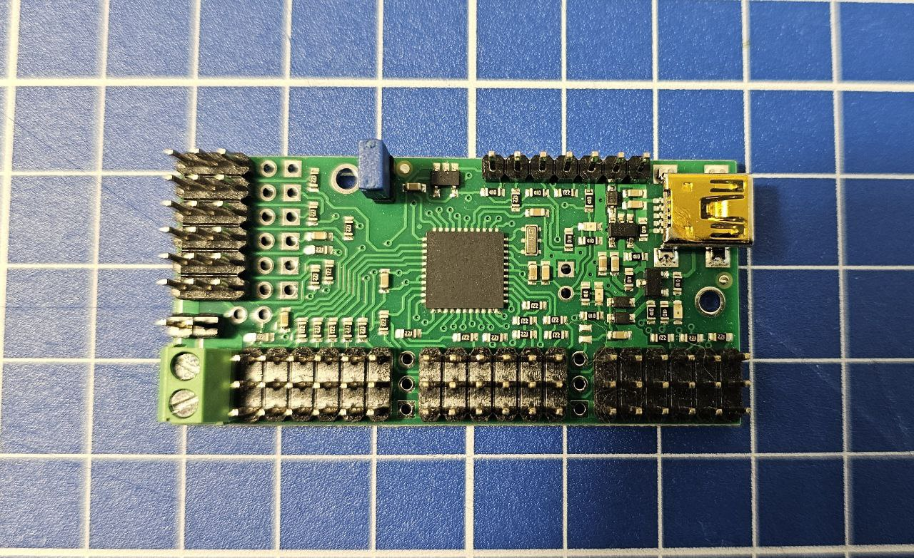

Цель проекта

Создать шестиногого робота (Hexapod) на базе Raspberry Pi 5, который сможет:
1. Передвигаться как паук (плавная походка, устойчивость, гибкие движения лап).
2. Интегрироваться с умным домом через Home Assistant — чтобы робот мог взаимодействовать с сенсорами и устройствами (например, как «ходячий ассистент»).
3. Быть платформой для экспериментов: компьютерное зрение, голосовое управление, навигация по квартире, использование датчиков.

# 🖥 Raspberry Pi 5 (в корпусе Argon One V3)

## 📖 Описание
Raspberry Pi 5 — это основной вычислительный блок робота-хексапода.  
Он установлен в корпус Argon One V3, который обеспечивает активное охлаждение и поддержку NVMe SSD.

---

## ⚙️ Основные характеристики
- Масса: 180 г
- 4-ядерный процессор ARM Cortex-A76 2.4 ГГц
- 8 ГБ RAM
- NVMe SSD через корпус Argon One V3
- Питание через фирменный блок питания 27 Вт USB-C
- Активное охлаждение (встроенный вентилятор и радиатор в корпусе)

## Роль в роботе
- Управляет движением лап через Pololu Maestro (USB)
- Обрабатывает данные с датчиков (LIDAR, BME680, микрофон ReSpeaker)
- Координирует работу походки и алгоритмов движения
- Отвечает за интеграцию с умным домом (Home Assistant, MQTT, Telegram Bot, Алиса)

  # ⚙️ Pololu Mini Maestro 24-Channel USB Servo Controller

## 📖 Описание
Pololu Mini Maestro 24 — это контроллер для управления сервоприводами.  
Используется в проекте хексапода для координации движений лап (каждая лапа имеет 3 привода: Coxa, Femur, Tibia).

---

## ⚙️ Основные характеристики
- размеры 85 х 35 мм
- масса: 14 г
- Управление до 24 сервоприводов  
- Интерфейсы: USB, TTL Serial  
- Поддержка скриптов автономного управления  
- Точная настройка скорости и ускорения для плавных движений  
- Возможность работы как в связке с Raspberry Pi, так и автономно  

---

## 🤖 Роль в роботе
- Принимает команды от Raspberry Pi 5 через USB  
- Управляет сервоприводами лап (Coxa, Femur, Tibia)  
- Обеспечивает плавное движение за счёт встроенных настроек скорости  
- Позволяет тестировать движение лап без запуска основного кода Raspberry Pi  
