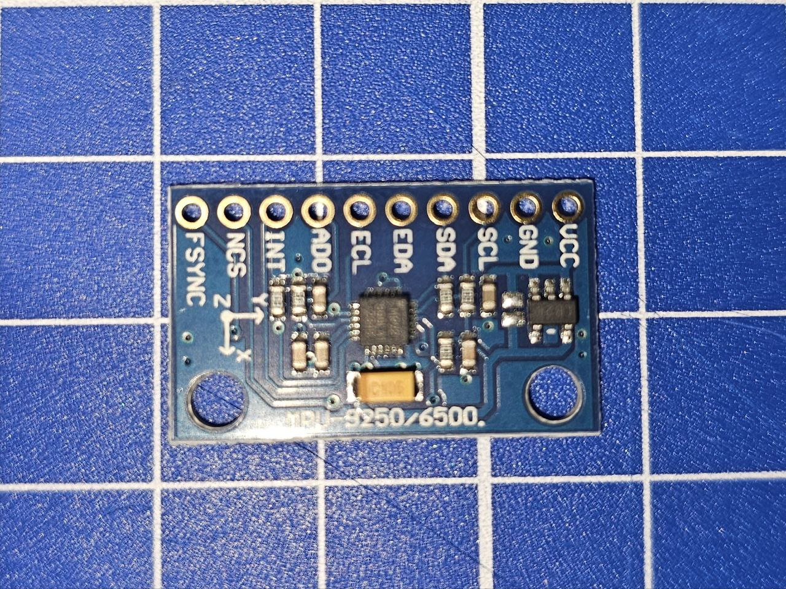
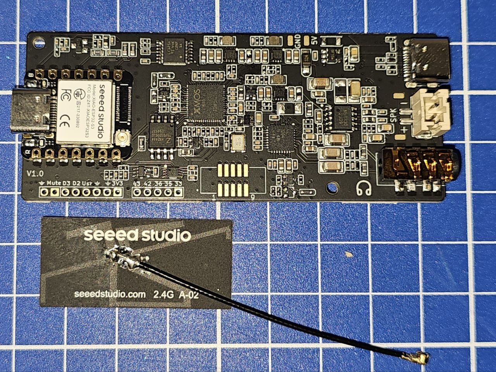
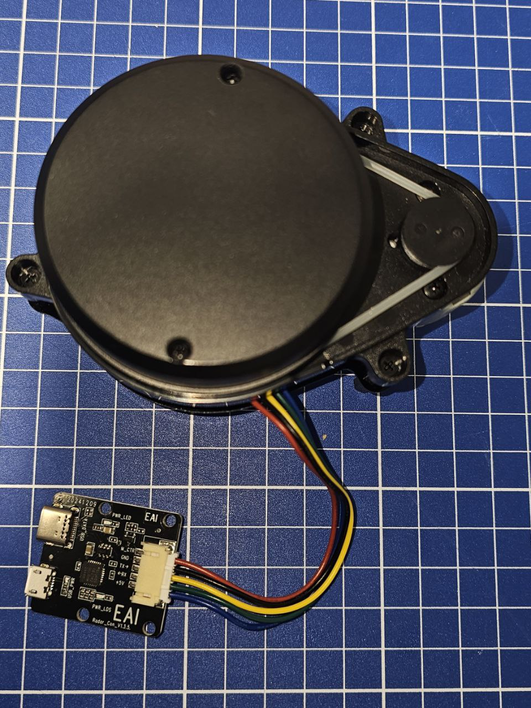
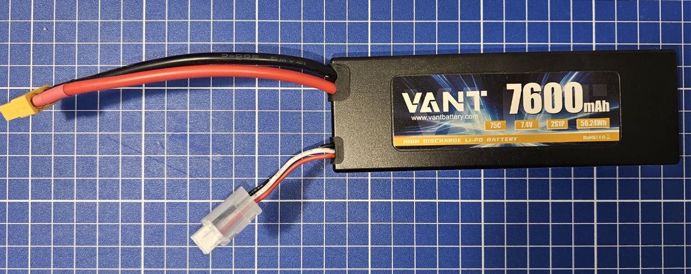
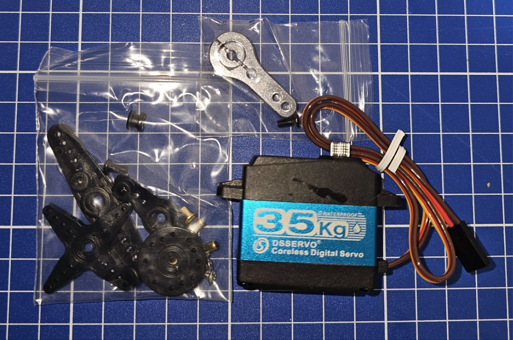
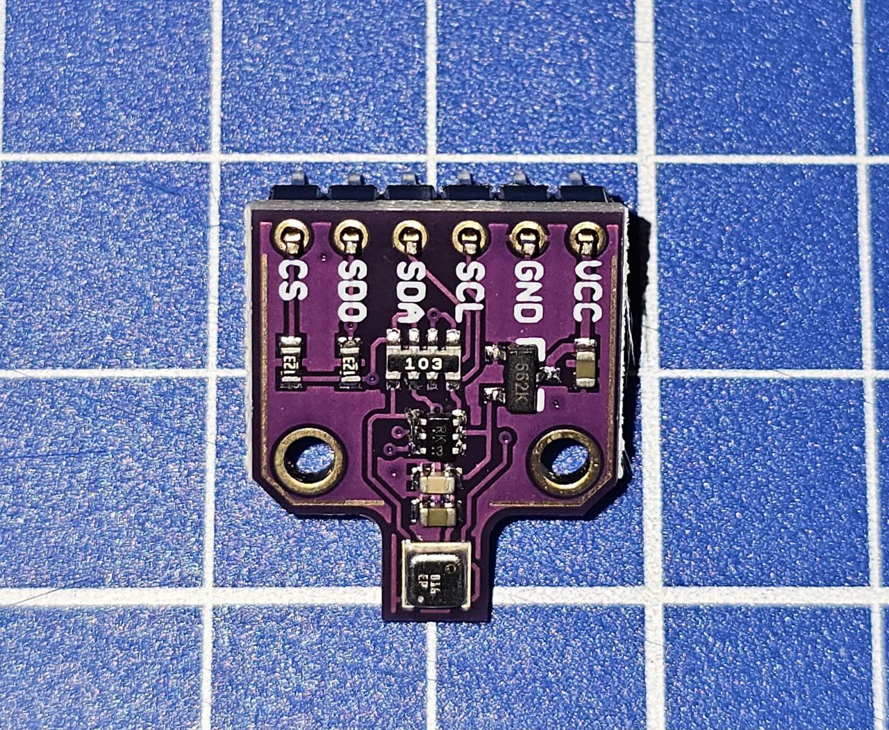

Цель проекта

Создать шестиногого робота (Hexapod) на базе Raspberry Pi 5, который сможет:
1. Передвигаться как паук (плавная походка, устойчивость, гибкие движения лап).
2. Интегрироваться с умным домом через Home Assistant — чтобы робот мог взаимодействовать с сенсорами и устройствами (например, как «ходячий ассистент»).
3. Быть платформой для экспериментов: компьютерное зрение, голосовое управление, навигация по квартире, использование датчиков.

# 🖥 Raspberry Pi 5 (в корпусе Argon One V3)

## 📖 Описание
Raspberry Pi 5 — это основной вычислительный блок робота-хексапода.  
Он установлен в корпус Argon One V3, который обеспечивает активное охлаждение и поддержку NVMe SSD.

---

## ⚙️ Основные характеристики
- Масса: 180 г
- 4-ядерный процессор ARM Cortex-A76 2.4 ГГц
- 8 ГБ RAM
- NVMe SSD через корпус Argon One V3
- Питание через фирменный блок питания 27 Вт USB-C
- Активное охлаждение (встроенный вентилятор и радиатор в корпусе)

---

## Роль в роботе
- Управляет движением лап через Pololu Maestro (USB)
- Обрабатывает данные с датчиков (LIDAR, BME680, микрофон ReSpeaker)
- Координирует работу походки и алгоритмов движения
- Отвечает за интеграцию с умным домом (Home Assistant, MQTT, Telegram Bot, Алиса)

# ⚙️ Pololu Mini Maestro 24-Channel USB Servo Controller

## 📖 Описание
Pololu Mini Maestro 24 — это контроллер для управления сервоприводами.  
Используется в проекте хексапода для координации движений лап (каждая лапа имеет 3 привода: Coxa, Femur, Tibia).

---

## ⚙️ Основные характеристики
- размеры 85 х 35 мм
- масса: 14 г
- Управление до 24 сервоприводов  
- Интерфейсы: USB, TTL Serial  
- Поддержка скриптов автономного управления  
- Точная настройка скорости и ускорения для плавных движений  
- Возможность работы как в связке с Raspberry Pi, так и автономно  

---

## 🤖 Роль в роботе
- Принимает команды от Raspberry Pi 5 через USB  
- Управляет сервоприводами лап (Coxa, Femur, Tibia)  
- Обеспечивает плавное движение за счёт встроенных настроек скорости  
- Позволяет тестировать движение лап без запуска основного кода Raspberry Pi

  # 🧭 MPU-6050 / MPU-6500 (Акселерометр + Гироскоп)

## 📖 Описание
Модуль MPU-6050/6500 — это датчик, который объединяет 3-осевой гироскоп и 3-осевой акселерометр.  
Используется в проекте хексапода для стабилизации движения и контроля положения робота.

---

## ⚙️ Основные характеристики
- Масса: ~2 г
- Напряжение питания: 3–5 В
- Интерфейс: I²C (SDA, SCL)
- Измерение ускорения: ±2 / ±4 / ±8 / ±16 g
- Измерение угловой скорости: ±250 / ±500 / ±1000 / ±2000 °/с
- Встроенный датчик температуры

---

## 🤖 Роль в роботе
- Отслеживает наклон и ускорение корпуса
- Позволяет корректировать походку на неровных поверхностях
- Может использоваться для балансировки робота при движении
- Передаёт данные в Raspberry Pi 5 через шину I²C

---

# 🎤 ReSpeaker 2-Mic HAT (Seeed Studio)

## 📖 Описание
ReSpeaker 2-Mic HAT — это аудиомодуль на базе чипа XMOS + AC108, оснащённый двумя микрофонами.  
Используется в проекте хексапода для захвата голосовых команд и интеграции с голосовыми ассистентами.

---

## ⚙️ Основные характеристики
- Масса: ~10 г
- Два всенаправленных MEMS-микрофона
- Поддержка USB Audio Class (совместим с Raspberry Pi без драйверов)
- Подавление шума и эхокомпенсация (базовый уровень на аппаратном уровне)
- Интерфейсы: USB Type-C / GPIO
- Дополнительный разъём для динамика (3.5 мм / JST)

---

## 🤖 Роль в роботе
- Захват голосовых команд от пользователя
- Передача аудиопотока в Raspberry Pi 5
- Интеграция с голосовыми помощниками (Яндекс Алиса, Google Assistant, Home Assistant)
- Используется для запуска команд типа: *«Астра, иди сюда»* или *«Робот, включи свет»*

# 📡 YDLIDAR X4 PRO

## 📖 Описание
YDLIDAR X4 PRO — это лидар (лазерный дальномер), предназначенный для сканирования окружения на 360°.  
В проекте хексапода он используется для навигации, построения карты помещения и обхода препятствий.

---

## ⚙️ Основные характеристики
- Масса: ~170 г
- Дальность измерения: 0.12 – 10 м
- Частота вращения: 5 – 12 Гц
- Разрешение угловое: ~0.5° – 1.0°
- Интерфейс: USB (через конвертер на плате), UART
- Напряжение питания: 5 В
- Угол обзора: 360°

---

## 🤖 Роль в роботе
- Сканирование пространства вокруг робота
- Построение карты помещений
- Обход препятствий и навигация
- Использование данных для автономного движения и интеграции с SLAM в Raspberry Pi 5

  # 🔋 Li-Po аккумулятор VANT 7.4V 7600 mAh

## 📖 Описание
Li-Po аккумулятор VANT — это литий-полимерная батарея ёмкостью 7600 mAh, напряжением 7.4 В (2S1P).  
Используется для питания сервоприводов и управляющей электроники робота.

---

## ⚙️ Основные характеристики
- Масса: ~280 г
- Тип: Li-Po (литий-полимерный)
- Количество ячеек: 2S1P (7.4 В)
- Ёмкость: 7600 mAh (56.24 Wh)
- Разрядный ток: 75C (высокий ток для мощных нагрузок)
- Разъёмы: XT60 (основной), JST-XH (балансир)

---

## 🤖 Роль в роботе
- Основной источник питания для сервоприводов
- Может обеспечивать стабильную работу Raspberry Pi через DC-DC преобразователь
- Используется для автономности хексапода
- Возможна установка нескольких батарей для увеличения времени работы

# ⚙️ Цифровой сервопривод DS3235 (35 кг·см)

## 📖 Описание
DS3235 — это мощный цифровой сервопривод с металлическими шестернями и моментом до 35 кг·см.  
Используется для суставов робота (Coxa, Femur, Tibia).  

---

## ⚙️ Основные характеристики
- Масса одного: ~60 г  
- Масса всех (18 шт): ~1080 г (1.08 кг)  
- Количество в роботе: 18 шт  
- Крутящий момент: до 35 кг·см при 8.4 В  
- Рабочее напряжение: 6.0 – 8.4 В  
- Угол поворота: 270°  
- Тип мотора: Coreless Digital  
- Материал шестерён: металл  
- Влагозащита: IP66  
- Интерфейс: стандартный PWM (3-pin)  

---

## 🤖 Роль в роботе
- По 3 сервопривода на каждую лапу:  
  - Coxa — поворот лапы в горизонтальной плоскости  
  - Femur — подъём и опускание  
  - Tibia — вынос вперёд-назад  
- Обеспечивают устойчивость и плавность походки  
- Совместимы с контроллером Pololu Mini Maestro 24  

---

# 🌡️ Датчик BME680 (Температура, Влажность, Давление, VOC)

## 📖 Описание
BME680 — это мультифункциональный датчик от Bosch.  
Он объединяет в себе измерение температуры, влажности, атмосферного давления и газов (VOC).  
В проекте хексапода используется для мониторинга окружающей среды и интеграции данных в умный дом.

---

## ⚙️ Основные характеристики
- Масса: ~3 г  
- Напряжение питания: 1.7 – 3.6 В (обычно 3.3 В)  
- Интерфейсы: I²C, SPI  
- Диапазон измерений:  
  - Температура: -40…+85 °C  
  - Влажность: 0 – 100 %RH  
  - Давление: 300 – 1100 hPa  
  - VOC (качество воздуха, эквивалент CO₂)  

---

## 🤖 Роль в роботе
- Мониторинг окружающей среды  
- Контроль температуры и влажности в помещении  
- Измерение качества воздуха (VOC)  
- Передача данных в Raspberry Pi → Home Assistant для автоматизации  
